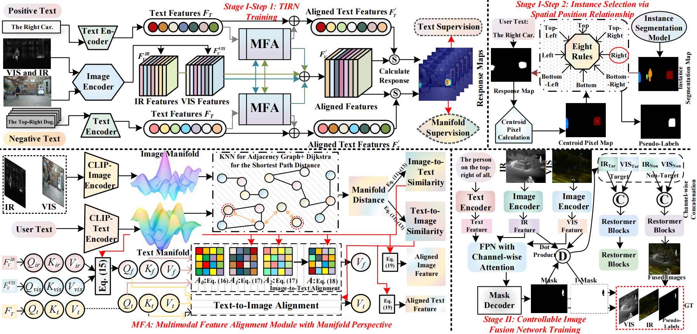
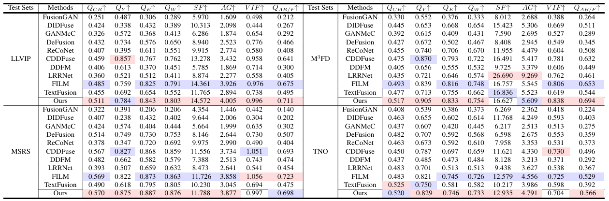

# Highlight What You Want

Codes for ***Highlight What You Want: Weakly-Supervised Instance-Level Controllable Infrared-Visible Image Fusion***. ***(ICCV 2025)***

------



------

### 1.Create Envrionment

- Create Conda Environment

```shell
conda create -n ris_fusion_env python=3.10
conda activate ris_fusion_env
```

- Install Dependencies

```shell
pip install -r requirements.txt
```

------

### 2.Pre-trained Weights

(1) The OMG_Seg weights is at [OMG](https://drive.google.com/drive/folders/14ZWOHOExb4FfQmwUgJQ2AtR83t7A3KiG?usp=drive_link). 

Please put them in `'RIS-FUSION/RISW-STAGE1-OS/model/OMG_Seg/models/'`

(2) The Pre-trained weights for stage1 is at [Stage1](https://drive.google.com/drive/folders/1poopCPc6x5hgIPShI4JOZaQ6JhdhxBGH?usp=drive_link). 

Please put them in `'RIS-FUSION/RISW-STAGE1-OS/weights/stage1/'`

(3) The Pre-trained weights for stage2 is at [Stage2](https://drive.google.com/drive/folders/1Enxz_1HuLAuWGpvHjqIGOoGjNRw5SUOy?usp=drive_link). 

Please put the '`best_model.pth`' in '`RISW-STAGE2-OS/CRIS/exp/refcoco/CRIS_R50`'  and the `'model_stage2.pth'` in `'RISW-STAGE2-OS/'`

------

### 3.Testing

##### RISW-STAGE1-OS

For generate pseudo-labels (Stage1), please run

```python
python ./RISW-STAGE1-OS/test_one_img.py
```

Result will be saved in the `'./RISW-STAGE1-OS/Result_single_mask/'` folder.

##### RISW-STAGE2-OS

For generate fusion image (Stage2), please run

```PYTHON
python ./RISW-STAGE2-OS/test_one_img.py
```

Result will be saved in the `'./RISW-STAGE2-OS/test_rusults/'` folder.

------

### 4.Training

##### RISW-STAGE1-OS

Please prepare the training data at

```python
data/ 
	IVT_train/
    	ir/
            1.png
            2.png
       		 ...
        vi/
            1.png
            2.png
            ...
        text/
            1.txt
            2.txt
            ... 	
```

Run the code

```python
python train_stage1.py
```

------

##### RISW-STAGE2-OS

Please prepare the training data at 

```PYTHON
dataset/ 
	IVT_final/
    	IVT_ir/
            1.png
            2.png
       		 ...
        IVT_vi/
            1.png
            2.png
            ...
        IVT_text/
            1.txt
            2.txt
            ... 	
```

After that, run the following command:

```python
python dataprocess.py
python train_fused.py
```
------

### 5.Fusion Results

1.Qualitative comparison of various fusion models.


------

2.Quantitative comparison of various fusion models across four test sets.



------

